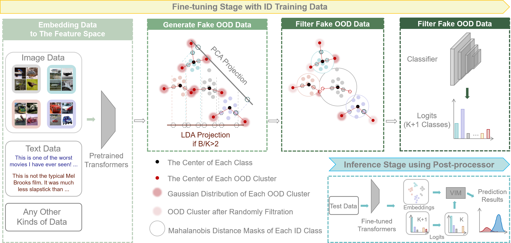

# **OOD-Detection-with-Transformers**
The implementation of our work "GROD: Enhancing Generalization of Transformer with Out-of-Distribution Detection".

## Introduction
Transformer networks excel in natural language processing (NLP) and computer vision (CV) tasks. However, they face challenges in generalizing to Out-of-Distribution (OOD) datasets, that is, data whose distribution differs from that seen during training. 
The OOD detection aims to distinguish data that deviates from the expected distribution, while maintaining optimal performance on in-distribution (ID) data. 
This paper introduces a novel approach based on OOD detection, termed the Generate Rounded OOD Data (GROD) algorithm, which significantly bolsters the generalization performance of transformer networks across various tasks. 
GROD is motivated by our new OOD detection Probably Approximately Correct (PAC) Theory for transformer. 
The transformer has learnability in terms of OOD detection that is, when the data is sufficient the outlier can be well represented.
By penalizing the misclassification of OOD data within the loss function and generating synthetic outliers, GROD guarantees learnability and refines the decision boundaries between inlier and outlier. 
This strategy demonstrates robust adaptability and general applicability across different data types. 
Evaluated across diverse OOD detection tasks in NLP and CV, GROD achieves SOTA regardless of data format. 
On average, it improves the SOTA FPR@95 by 9.29% on image classification tasks when Cifar-10 as ID, and by 12.89% in detecting semantic text outliers.

:fire: For more information have a look at our paper (coming soon).

Authors: 

## News :new:

## Installation

The code has been tested with Python 3.8, CUDA 11.8, and pytorch 2.2.0+cu118. Any other version may require to update the code for compatibility.

## Data preparation
To download the data and display the data with proper structure of folders, follow the instructions provided by [OpenOOD](https://github.com/Jingkang50/OpenOOD). Actually, this code of GROD follows the structure of OpenOOD and can be added into this elegant repository.

## Commands

